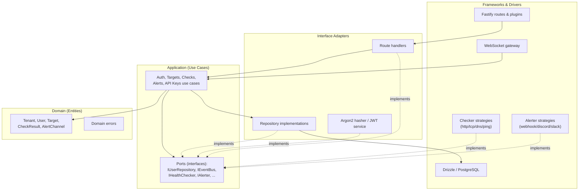
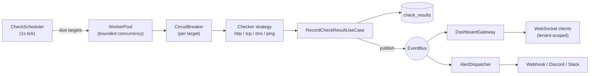
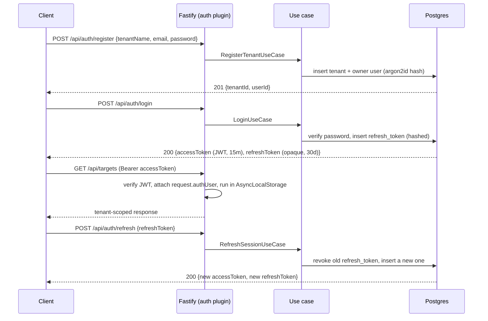

# Architecture

Pulse follows Clean Architecture: dependencies point inward, and the domain has no
knowledge of Fastify, Drizzle, or any other framework. Every use case depends only on
interfaces (`application/ports`, `domain/repositories`); concrete implementations
(Drizzle repositories, the Argon2 hasher, the JWT service, the health checkers, the
alerters) live in `infrastructure` and are wired together in one composition root:
[`container.ts`](../src/infrastructure/composition/container.ts).

**Contents**: [Layers](#layers) · [Design patterns](#design-patterns) ·
[Monitoring engine](#the-monitoring-engine) · [Multitenancy](#multitenancy) ·
[Authentication](#authentication) · [Observability](#observability) ·
[Project structure](#project-structure)



---

## Layers

### Domain (`src/domain`)

A rich model, not a bag of data classes — nothing here imports from `application` or
`infrastructure`.

- **Entities** (`entities/`) carry the invariants that are naturally theirs:
  - `Target.validateConfig` — a target's config is only valid relative to its own check type
  - `RefreshToken.isValid` / `PasswordResetToken.isValid` — expiry + revocation/use,
    checked in one place instead of re-derived at every call site
  - `ApiKey.isRevoked` / `matchesHash` — constant-time comparison against an
    already-hashed candidate
  - `CheckResult.hasStatusChangeFrom` — the up/down transition check that drives alerting
  - `User.toPublic` — the one place that decides a password hash never leaves the domain
  - `Tenant` and `AlertChannel` stay plain data — they have no invariants of their own to
    encapsulate, so wrapping them in a class would be ceremony, not behavior
- **Value objects** (`value-objects/`) — currently `Email`: validates format and
  normalizes casing/whitespace at construction, so two differently-cased inputs can never
  be treated as different addresses. `Role` / `CheckType` / `CheckStatus` are simple
  string union types, not full value objects — there's no behavior to attach beyond
  "one of these values".
- **Repositories** (`repositories/`) — interfaces only; implementations live in
  `infrastructure`.
- **Errors** (`errors/`) — `NotFoundError`, `ConflictError`, `ValidationError`,
  `UnauthorizedError`, `ForbiddenError`.

### Application (`src/application`)

Use cases (one class per operation: `LoginUseCase`, `CreateTargetUseCase`,
`RecordCheckResultUseCase`, ...) and *ports* — the interfaces a use case needs from the
outside world (`IPasswordHasher`, `ITokenService`, `IEventBus`, `IHealthChecker`,
`IAlerter`, `IClock`, `IMailer`). A use case is constructed with its dependencies
(constructor injection) and never imports a concrete infrastructure class.

### Infrastructure (`src/infrastructure`)

Everything that talks to the outside world:

| Directory | Contents |
|---|---|
| `database/` | Drizzle schema, migration runner, repository implementations |
| `security/` | Argon2 password hasher, JWT + opaque-token service |
| `checkers/` | Strategy implementations: `HttpChecker`, `TcpChecker`, `DnsChecker`, `PingChecker`, plus `HealthCheckerFactory` |
| `alerters/` | Strategy implementations: `WebhookAlerter`, `DiscordAlerter`, `SlackAlerter`, plus `AlerterFactory` and `AlertDispatcher` |
| `concurrency/` | `WorkerPool`, `CircuitBreaker` (+ `CircuitBreakerRegistry`), `CheckScheduler` |
| `events/` | `EventBus` (Observer/Pub-Sub over `node:events`) |
| `websocket/` | `ConnectionManager`, `DashboardGateway` |
| `metrics/` | `prom-client` registry + custom metrics |
| `context/` | `AsyncLocalStorage`-based request context |
| `http/` | Fastify app factory, plugins (auth / tenant-context / rbac / error-handler), route handlers |
| `composition/` | `container.ts` — the manual dependency-injection composition root |

### Frontend (`web/`)

Vite + Vue 3 (`<script setup>` SFCs, Vue Router, a module-singleton composable for auth
state — no Vuex/Pinia needed at this scope), served by Fastify's static plugin in
production, or by its own dev server (with hot reload) proxying `/api` and `/ws` to the
backend in dev.

---

## Design patterns

| Pattern | Where |
|---|---|
| **Strategy** | `IHealthChecker` (ping/http/tcp/dns) and `IAlerter` (webhook/discord/slack) — one class per variant, selected at runtime |
| **Factory** | `HealthCheckerFactory` and `AlerterFactory` resolve the right strategy for a target's type or a channel's type |
| **Repository** | One interface per aggregate in `domain/repositories`, with a Drizzle implementation in `infrastructure/database/repositories` — the application layer only ever sees the interface |
| **Observer / Pub-Sub** | `EventBus` publishes `check.completed` and `target.status_changed`; the WebSocket gateway and the alert dispatcher subscribe independently, unaware of each other |
| **Worker pool** | `WorkerPool` — a bounded-concurrency async semaphore that caps how many health checks run at once |
| **Circuit breaker** | `CircuitBreaker` (closed → open → half-open) isolates a single chronically-failing target so it can't monopolize worker slots or hammer a dead endpoint |
| **Middleware / chain of responsibility** | Fastify preHandlers: `authenticate` (verify JWT/API key) → `withTenantContext` (bind `AsyncLocalStorage`) → `requireRole` (RBAC gate) |
| **Composition root (manual DI)** | `infrastructure/composition/container.ts` constructs every concrete implementation and wires it to the interface its consumers depend on |
| **Value Object** | `Email` (`domain/value-objects`) — validated and normalized at construction, so an invalid or inconsistently-cased address can't exist inside the domain at all |

---

## The monitoring engine



**Scheduling.** Every second, `CheckScheduler` asks the target repository for every
*enabled* target across *every* tenant, and figures out which ones are due (based on
each target's own `intervalSeconds` and when it last ran). Due targets are submitted to
a `WorkerPool` — a fixed-size async semaphore, not an OS `worker_threads` pool. That's
deliberate: the work here is I/O-bound (HTTP requests, TCP connects, DNS lookups, a
spawned `ping` process), and Node's event loop already handles concurrent I/O well; real
OS threads would only add serialization overhead. See the note in
[`worker-pool.ts`](../src/infrastructure/concurrency/worker-pool.ts) for the upgrade path
(swap in `piscina`) if a checker ever becomes CPU-bound.

**Isolation.** Each target is additionally wrapped in its own `CircuitBreaker`
(`failureThreshold` / `resetTimeoutMs` configurable via env). Once a target has failed
enough consecutive checks, the breaker opens and short-circuits further attempts against
it for a cooldown window — a target that's down doesn't get to consume a worker slot
(and network resources) every single tick just to fail again immediately.

**Recording.** A completed check flows through `RecordCheckResultUseCase`, which:

1. Persists the `CheckResult` row
2. Publishes `check.completed` unconditionally (this is what drives the live dashboard)
3. Publishes `target.status_changed` **only if the status differs from the previous
   check** (this is what drives alerting) — so a target that's healthy every 30s doesn't
   re-trigger a Slack message every 30s, only when it actually flips up↔down

**Fan-out.** Two independent subscribers react to those events without knowing about
each other: `DashboardGateway` (broadcasts to that tenant's connected WebSocket clients)
and `AlertDispatcher` (fans the status-change out to every enabled alert channel for that
tenant, isolating failures per channel so one broken Slack webhook doesn't block a
Discord one from firing).

---

## Multitenancy

- **Enforced at the repository interface.** Every tenant-owned table (`users`,
  `targets`, `check_results`, `alert_channels`, `api_keys`, `refresh_tokens`) has a
  `tenant_id` column, and every repository method that reads or writes tenant data takes
  `tenantId` as an explicit parameter — see [`domain/repositories`](../src/domain/repositories).
  There's no ambient "current tenant" threaded implicitly through an ORM session; a
  repository call that forgets to filter by tenant simply doesn't compile against the
  interface.
- **Never trusted from the client.** The tenant id used everywhere is never taken from
  the request body, URL, or query string — it comes only from `request.authUser.tenantId`,
  populated by the `authenticate` plugin from the verified JWT (or API key) and nothing
  else. The [tenant-isolation integration test](../tests/integration/tenant-isolation.integration.test.ts)
  asserts that a target created by one tenant returns `404` (not `403`, to avoid
  confirming the resource even exists) for every other tenant, and that a `tenantId`
  supplied in a request body is silently ignored in favor of the JWT's.
- **Propagated via `AsyncLocalStorage`.** [`request-context.ts`](../src/infrastructure/context/request-context.ts)
  carries `{ requestId, tenantId, userId, role }` through the async call stack for the
  lifetime of a request. Today that's used to enrich every log line with the acting
  tenant/user without threading it through every function signature — but it's available
  to any code invoked deeper in the stack that doesn't have it as an explicit parameter
  (e.g. work triggered by a request but continuing after the response is sent).

---

## Authentication



- **Access tokens** are short-lived JWTs (`JWT_ACCESS_TTL`, default 15m), signed with
  `fast-jwt` and verified on every request with no database lookup.
- **Refresh tokens** are high-entropy opaque strings (never JWTs), stored only as a
  SHA-256 hash. Every refresh **rotates** the token: the presented one is revoked and a
  new one issued, so a replayed/stolen refresh token is detected the instant either
  party uses it again (`RefreshSessionUseCase`).
- **Passwords** are hashed with `argon2id`.
- **Emails** are normalized (trimmed, lowercased) through the `Email` value object at
  every entry point — registration, login, and password-reset requests — so
  `"Foo@Bar.com"` and `"foo@bar.com"` are always the same account. A malformed address
  degrades to whatever response the use case already gives for "no such account" (a
  generic 401 on login, a silent no-op on password-reset requests) rather than exposing
  a distinct validation error.
- **RBAC**: three roles, `owner > admin > member` (`roleAtLeast` in
  [`domain/entities/role.ts`](../src/domain/entities/role.ts)). Routes declare a minimum
  role via `app.requireRole('admin')` etc.
- **API keys** (`X-API-Key` header) are an alternative to JWTs for programmatic access,
  scoped to a tenant, stored as a hash plus a short lookup prefix (Stripe-style),
  verified with a constant-time comparison. They carry a fixed `member` role today — see
  the `ponytail` note in
  [`auth.plugin.ts`](../src/infrastructure/http/plugins/auth.plugin.ts) for the upgrade
  path to per-key scopes.
- **Password reset** is a basic token-based flow (`request` issues and logs a one-hour
  opaque token; `confirm` sets a new password and revokes all of that user's refresh
  tokens). No real email provider is wired up — see
  [`console-mailer.ts`](../src/infrastructure/notifications/console-mailer.ts).
- **WebSocket auth**: the dashboard socket is authenticated via `?token=<accessToken>` in
  the connection URL (browsers can't set custom headers on `WebSocket`), verified
  identically to the JWT on HTTP routes.

---

## Observability

- `GET /healthz` / `GET /readyz` — liveness/readiness
- `GET /metrics` — Prometheus exposition format: default Node process metrics plus
  `pulse_checks_total{type,status}`, `pulse_check_duration_seconds{type}`,
  `pulse_http_requests_total{method,route,statusCode}`
- Structured JSON logs via `pino`, enriched with `tenantId`/`userId` pulled from the
  request's `AsyncLocalStorage` context
- Graceful shutdown on `SIGTERM`/`SIGINT`: stop the scheduler, stop the event
  subscribers, close all WebSocket connections, close the Fastify server, close the DB
  connection pool — in that order, so in-flight work finishes cleanly

---

## Project structure

```
src/
  domain/
    entities/            Rich entities: Target, RefreshToken, PasswordResetToken,
                         ApiKey, User, CheckResult (+ plain data: Tenant, AlertChannel)
    value-objects/       Email (validates + normalizes at construction)
    repositories/        Repository interfaces (one per aggregate)
    errors/              NotFoundError, ConflictError, ValidationError, ...
  application/
    ports/             IPasswordHasher, ITokenService, IEventBus, IHealthChecker, ...
    use-cases/         auth/ targets/ checks/ alerts/ api-keys/
  infrastructure/
    database/          Drizzle schema, migrations runner, repository implementations
    security/          Argon2 hasher, JWT/opaque-token service
    checkers/          Strategy implementations: http, tcp, dns, ping + factory
    alerters/          Strategy implementations: webhook, discord, slack + factory + dispatcher
    concurrency/       WorkerPool, CircuitBreaker(+Registry), CheckScheduler
    events/            EventBus (Observer/Pub-Sub)
    websocket/         ConnectionManager, DashboardGateway
    metrics/           prom-client registry + custom metrics
    context/           AsyncLocalStorage request context
    http/              Fastify app, plugins (auth/tenant-context/rbac/error-handler), routes
    composition/       container.ts — manual DI composition root
  shared/              Config (Zod-validated env), small utils
  main.ts              Entrypoint: wiring, graceful shutdown
web/                   Vite + Vue dashboard (served by Fastify's static plugin in prod)
tests/
  unit/                Use cases (with in-memory fakes) + concurrency primitives
  integration/         Full HTTP flow against a real Postgres (auth, tenant isolation)
drizzle/               Generated SQL migrations
docker/                Prometheus/Grafana provisioning config
```
